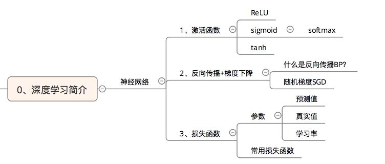
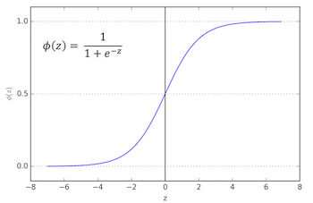
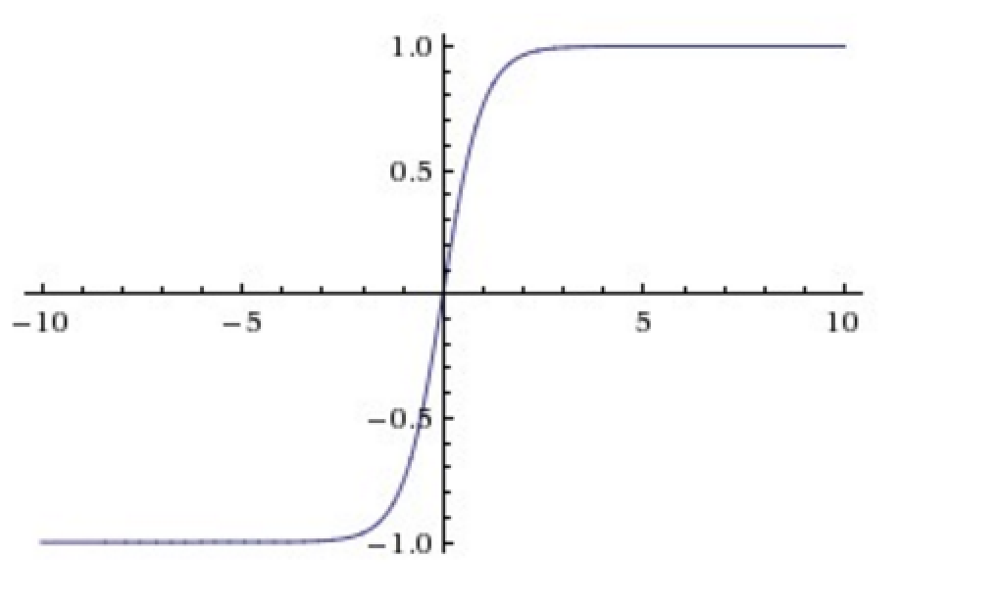
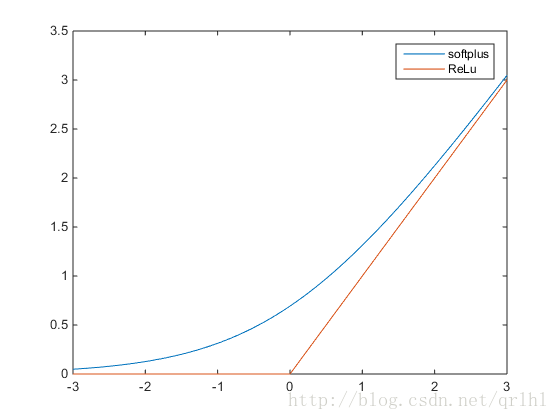
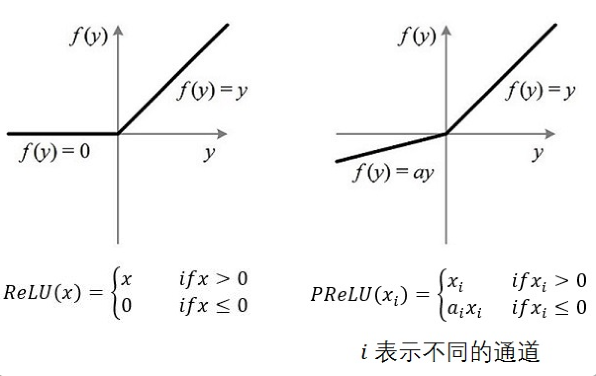
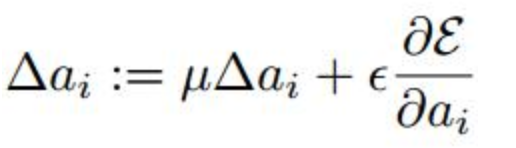

# 神经网络 激活函数
- 激活函数是用来加入非线性因素的，因为线性模型的表达能力不够



## 常用的 激活函数
### 1. sigmod (softmax 激活)
  
  * Sigmoid函数是传统神经网络中最常用的激活函数，一度被视为神经网络的核心所在。
　　从数学上来看，Sigmoid函数对中央区的信号增益较大，对两侧区的信号增益小，在信号的特征空间映射上，有很好的效果。
　　从神经科学上来看，中央区酷似神经元的兴奋态，两侧区酷似神经元的抑制态，因而在神经网络学习方面，可以将重点特征推向中央区，将非重点特征推向两侧区。
  * **Sigmoid的缺陷** 通过Sigmoid的函数图像我们可以直观的看到，当输入值X>5或者X<-5的时候，函数的变化曲线已经非常平缓了，这就意味着此时的偏导（即切线的斜率）非常小接近0，这就导致误差反向传播无法通过导数传递到上一层，进而导致训练无法正常训练（导数为0无法更新参数）
### 2. Tanh 激活
  * Tanh是sigmoid的变形：tanh(x)=2σ(2x)−1
  
  * 在具体应用中，tanh函数相比于Sigmoid函数往往更具有优越性，这主要是因为Sigmoid函数在输入处于[-1,1]之间时，函数值变化敏感，一旦接近或者超出区间就失去敏感性，处于饱和状态，影响神经网络预测的精度值。而tanh的输出和输入能够保持非线性单调上升和下降关系，符合BP网络的梯度求解，容错性好，有界，渐进于0、1，符合人脑神经饱和的规律，但比sigmoid函数延迟了饱和期
  
### 3. Relu 激活
 * 为了解决 **sigmod** 函数 梯度饱和效应的产生，Hinton等人与2010年又提出了ReLU函数，可以有效的避免梯度饱和产生
  
 
 * **为什么引入Relu呢** 
    * 采用sigmoid等函数，算激活函数时（指数运算），计算量大，反向传播求误差梯度时，求导涉及除法，计算量相对大，而采用Relu激活函数，整个过程的计算量节省很多.
    * 对于深层网络，sigmoid函数反向传播时，很容易就会出现梯度消失的情况（在sigmoid接近饱和区时，变换太缓慢，导数趋于0，这种情况会造成误差信息丢失从而无法完成深层网络的训练。
    * Relu会使一部分神经元的输出为0，这样就造成了网络的稀疏性，并且减少了参数的相互依存关系，缓解了过拟合问题的发生。
 
 * ReLU. 近年来，ReLU 变的越来越受欢迎。它的数学表达式是： f(x)=max(0,x)。很显然，从上图左可以看出，输入信号 <0时，输出为0，>0时，输出等于输入。ReLU的优缺点如下：
    * **优点1**：[Krizhevsky et al.](http://www.cs.toronto.edu/~fritz/absps/imagenet.pdf) 发现使用 ReLU 得到的SGD的收敛速度会比 sigmoid/tanh 快很多(如上图右)。有人说这是因为它是linear，而且梯度不会饱和
    * **优点2**：相比于 sigmoid/tanh需要计算指数等，计算复杂度高，ReLU 只需要一个阈值就可以得到激活值
    * **缺点1**： ReLU在训练的时候很”脆弱”，一不小心有可能导致神经元”坏死”。举个例子：由于ReLU在x<0时梯度为0，这样就导致负的梯度在这个ReLU被置零，而且这个神经元有可能再也不会被任何数据激活。如果这个情况发生了，那么这个神经元之后的梯度就永远是0了，也就是ReLU神经元坏死了，不再对任何数据有所响应。实际操作中，如果你的learning rate 很大，那么很有可能你网络中的40%的神经元都坏死了。 当然，如果你设置了一个合适的较小的learning rate，这个问题发生的情况其实也不会太频繁
    
    
### 4. PReLU 激活
* PReLU. 对于 Leaky ReLU 中的a，通常都是通过先验知识人工赋值的。然而可以观察到，损失函数对a的导数我们是可以求得的，可不可以将它作为一个参数进行训练呢? Kaiming He 2015的论文[《Delving Deep into Rectifiers: Surpassing Human-Level Performance on ImageNet Classification》](http://arxiv.org/abs/1502.01852)指出，不仅可以训练，而且效果更好。原文说使用了Parametric ReLU后，最终效果比不用提高了1.03%.
* PReLU(Parametric Rectified Linear Unit), 顾名思义：带参数的ReLU。二者的定义和区别如下图:
    
* 如果ai=0，那么PReLU退化为ReLU；如果ai是一个很小的固定值(如ai=0.01)，则PReLU退化为Leaky ReLU(LReLU)。 有实验证明，与ReLU相比，LReLU对最终的结果几乎没什么影响。
* **PReLU的几点说明**
    * （1） PReLU只增加了极少量的参数，也就意味着网络的计算量以及过拟合的危险性都只增加了一点点。特别的，当不同channels使用相同的ai时，参数就更少了。
    * （2） BP更新ai时，采用的是带动量的更新方式，如下图：
        
       
       **注**: 上式的两个系数分别是动量和学习率。 需要特别注意的是：更新ai时不施加权重衰减(L2正则化)，因为这会把ai很大程度上push到0。事实上，即使不加正则化，试验中ai也很少有超过1的。


### 如何选择为自己的模型选择合适的激活函数？
到底应该在自己构建的神经网络中使用哪种激活函数，并没有固定的答案。根据前人总结的经验：
```通常使用tanh激活函数要比sigmoid收敛速度更快；```

- 在较深层的神经网络中，选用relu激活函数能使梯度更好地传播回去，但当使用**softmax**作为最后一层的激活函数时，其前一层最好不要使用relu进行激活，而是使用tanh作为替代，否则最终的loss很可能变成Nan；
- 当选用高级激活函数时，建议的尝试顺序为**ReLU**-**>ELU**->**PReLU**->**MPELU**，因为前两者没有超参数，而后两者需要自己调节参数使其更适应构建的网络结构


##### [更多关于 激活函数 请参见这篇博文](http://blog.csdn.net/cyh_24/article/details/50593400)